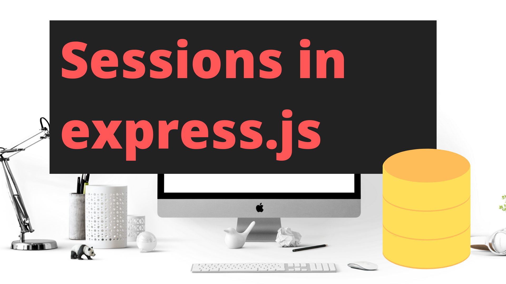

# Express Session with Redis

This repository contains sample code on how to use [Redis](https://redis.io) for a cookie-based session implementation with [Redis](https://redis.io) and the Node.js [express](https://expressjs.com/) framework.

<h3 align="center">Please help this repo with a ⭐️ if you find it useful! 😁</h3>

This repository is part of the [Sessions in express.js tutorial series on YouTube](https://www.youtube.com/watch?v=bvQah0k5-eA&list=PL1Nml43UBm6fPP7cW9pAFTdZ_9QX2mBn2) provided by [productioncoder.com](https://productioncoder.com/).

[](https://www.youtube.com/watch?v=bvQah0k5-eA&list=PL1Nml43UBm6fPP7cW9pAFTdZ_9QX2mBn2)

For updates, please reach out to [@_jgoebel](https://twitter.com/_jgoebel) on Twitter.

## Session implementation with express.js and express-session

This repository illustrates how to create a session-based authentication system in [Express.js](https://expressjs.com/) and what configurations you need to perform for you server to also accept cookies from cross origins - a scenario that is typical for Single Page Applications (SPAs) written in modern frameworks such as [React](https://reactjs.org/) or [Vue](https://vuejs.org/).

## Running this project

### 1. Installing Redis

Make sure that you have _[Redis](https://redis.io) running locally_ on your machine on its _default_ port `6379`.

This project assumes that your [Redis](https://redis.io) instance does _not require a password_ (which is the default).

If your local [Redis](https://redis.io) requires a password, please update the `db/redis.js` file to include the password field:

```
const redisClient = redis.createClient({
    port: 6379,
    host: 'localhost',
    password: 'your-password'
});
```

If you are on macOS, the easiest way to start up a [Redis](https://redis.io) instance is by using [Homebrew](https://brew.sh/)

```
brew install redis
brew services start redis
```

To stop [Redis](https://redis.io), you can run

```
brew services  stop redis
```

### 2. Install dependencies

Run:

```
npm install
```

to install the project's dependencies.

### 3. Start server

Execute the `dev` script to start up your server.

```
npm run dev
```
